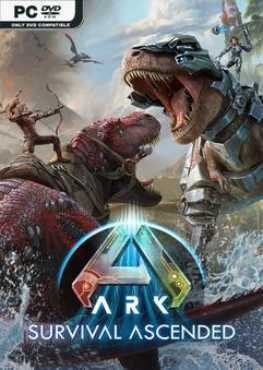

# 🦖 ARK: Survival Ascended (Build 28072025) - Việt Hóa Full Online / Offline

---

## 📖 Giới Thiệu Game

**ARK: Survival Ascended** là bản tái sinh toàn diện của tựa game sinh tồn huyền thoại *ARK: Survival Evolved*, được tái xây dựng từ đầu trên nền tảng công nghệ thế hệ mới **Unreal Engine 5**. 

Bạn sẽ thức dậy trên một hòn đảo bí ẩn nguyên thủy, học cách thích nghi với môi trường khắc nghiệt, xây dựng căn cứ, chế tạo vũ khí và chinh phục hàng trăm loài khủng long cùng sinh vật cổ đại độc đáo để vươn lên đứng đầu chuỗi thức ăn.

---

## 📋 Thông Tin Chi Tiết

| Thuộc tính | Chi tiết |
| :--- | :--- |
| **Nhà phát hành** | Studio Wildcard |
| **Ngày phát hành** | 06/11/2023 |
| **Phiên bản cập nhật** | Build 28072025 *(Cập nhật ngày 01/08/2025)* |
| **Dung lượng bộ cài** | ~199 GB |
| **Thể loại** | Sinh tồn, Thế giới mở, Hành động, Nhập vai, FPS |
| **Chế độ chơi** | Offline, Online, Co-op, Multiplayer (Lên tới 70 người chơi) |
| **Ngôn ngữ hỗ trợ** | Tiếng Việt, Tiếng Anh, Tiếng Nhật, Tiếng Trung, Tiếng Hàn, Tiếng Pháp, Tiếng Tây Ban Nha, Tiếng Nga |

---

## ✨ Đặc Điểm Nổi Bật

* **Đồ Họa UE5 Đỉnh Cao:** Áp dụng công nghệ chiếu sáng động **Lumen** (Global Illumination) và dựng hình chi tiết **Nanite** giúp tái hiện từng ngọn cỏ, dòng nước và bộ lông khủng long vô cùng chân thực.
* **Hệ Thống Vật Lý Môi Trường Tương Tác:**
  * Mặt nước tạo sóng, bọt khí và gợn sóng chính xác theo chuyển động của sinh vật.
  * Tán lá, cây cối phản ứng linh hoạt khi bị nhân vật va chạm, trúng đạn hoặc do đòn tấn công từ khủng long.
  * Công trình sụp đổ vỡ vụn sinh động, tương tác chân thực với địa hình xung quanh.
* **Trọn Bộ Nội Dung Mở Rộng:** Bao gồm tất cả các bản đồ thế giới của ARK như *The Island, Scorched Earth, Aberration, Extinction, ARK Genesis Part 1 & Part 2*.
* **Cải Tiến Quality of Life (QoL):** 
  * Thiết kế lại toàn bộ giao diện người dùng (UI).
  * Định vị chuyển động sinh vật thông minh hơn, bổ sung thêm hệ thống sinh vật con dại (Wild Babies).
  * Tích hợp Chế độ chụp ảnh (Photo Mode), hệ thống camera và theo dõi bản đồ mới.
* **Tính Năng Đa Nền Tảng (Cross-Platform):** Tải và cài đặt trực tiếp các bản Mod do cộng đồng sáng tạo thông qua trình duyệt Mod tích hợp sẵn trong game.

---

## 🖼️ Hình Ảnh Trong Game

---

## 💻 Cấu Hình Yêu Cầu

### Cấu hình tối thiểu (Minimum)
* **Hệ điều hành:** Windows 10 64-bit
* **CPU:** AMD Ryzen 5 2600X hoặc Intel Core i7-6800K
* **RAM:** 16 GB
* **Card đồ họa (GPU):** AMD Radeon RX 5600 XT hoặc NVIDIA GeForce GTX 1080
* **DirectX:** Version 12
* **Dung lượng ổ đĩa:** 80 GB chỗ trống khả dụng (khuyên dùng SSD)
* **Kết nối:** Cáp mạng Internet

### Cấu hình đề nghị (Recommended)
* **Hệ điều hành:** Windows 10 64-bit
* **CPU:** AMD Ryzen 5 3600X hoặc Intel Core i5-10600K
* **RAM:** 16 GB
* **Card đồ họa (GPU):** AMD Radeon RX 6800 hoặc NVIDIA GeForce RTX 3080
* **DirectX:** Version 12
* **Dung lượng ổ đĩa:** 110 GB chỗ trống khả dụng (khuyên dùng SSD)
* **Kết nối:** Cáp mạng Internet

---

## 🛠️ Hướng Dẫn Cài Đặt (Bản Offline / Việt Hóa Sẵn)

1. Tải đầy đủ 5 Part từ danh sách link bên dưới về cùng một thư mục.
2. Giải nén file vừa tải về bằng phần mềm WinRAR hoặc 7-Zip với mật khẩu: `topgamepc.com`
3. Mở thư mục đã giải nén, truy cập theo đường dẫn:
   `ShooterGame\Binaries\Win64`
4. Tìm và khởi chạy file `ArkAscended.exe` để bắt đầu chơi game.
*(Bản game đã được tích hợp sẵn gói Việt Hóa, không cần thao tác chép đè thủ công)*.

> **📌 Lưu ý quan trọng:**
> * Nên tắt tạm thời phần mềm diệt virus hoặc Windows Defender trước khi giải nén để tránh bị xóa nhầm file kích hoạt game.
> * Cài đặt đầy đủ bộ thư viện `Visual C++ Redistributable` và `DirectX` mới nhất nếu gặp lỗi thiếu file `.dll` khi mở game.

---

## 📥 Link Tải Game (Tự Động Tải Trực Tiếp)

<a href="https://drive.google.com/uc?export=download&confirm=t&id=1XtzBKP0wmSjWz2VoOsED-I9OPBoJO1CK"><button style="background-color: #4285F4; color: white; padding: 10px 20px; border: none; border-radius: 5px; cursor: pointer; font-weight: bold; margin: 5px;">🔴 Tải Game - PART 1</button></a>
	<a href="https://drive.google.com/uc?export=download&confirm=t&id=1vsbveyYefLzMwgMGIhn3uHjOyPaGzPPo"><button style="background-color: #4285F4; color: white; padding: 10px 20px; border: none; border-radius: 5px; cursor: pointer; font-weight: bold; margin: 5px;">🔵 Tải Game - PART 2</button></a>
	<a href="https://drive.google.com/uc?export=download&confirm=t&id=1s-onDIh6mJ7GVgDc5ubAeF3WZ2o0h_Zh"><button style="background-color: #4285F4; color: white; padding: 10px 20px; border: none; border-radius: 5px; cursor: pointer; font-weight: bold; margin: 5px;">🟢 Tải Game - PART 3</button></a>
	<a href="https://drive.google.com/uc?export=download&confirm=t&id=1U2PWfpB7lsyZq2I146o9SrzMCuKSQ3yM"><button style="background-color: #4285F4; color: white; padding: 10px 20px; border: none; border-radius: 5px; cursor: pointer; font-weight: bold; margin: 5px;">🟡 Tải Game - PART 4</button></a>
	<a href="https://drive.google.com/uc?export=download&confirm=t&id=11WxILUaU0D75GnbO075Kpq2bM-S1TKd5"><button style="background-color: #4285F4; color: white; padding: 10px 20px; border: none; border-radius: 5px; cursor: pointer; font-weight: bold; margin: 5px;">🟣 Tải Game - PART 5</button></a>
